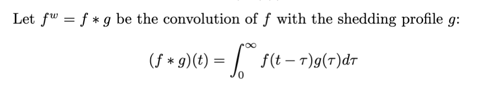
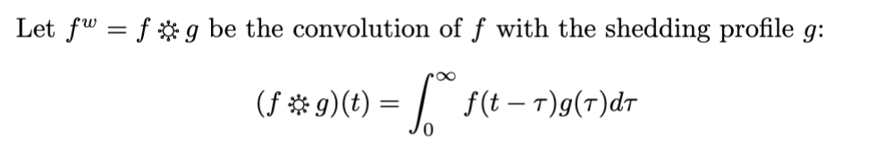

# covconv
A viral new operator 


## Quick start

1. Download [`covconv.sty`](covconv.sty) into your project folder.
2. Add in your preamble:

```latex
   \usepackage{covconv}
```
Now instead of doing this in your papers about viral shedding:
```latex
% Boring and plain
Let $f^w = f * g$ be the convolution of $f$ with the shedding profile $g$:

$$
  (f * g)(t) = \int_0^\infty f(t-\tau) g(\tau)d\tau
$$
```
<p align="center">
  
</p>

Do this:
```latex
\EnableCoronaAsterisk
% Really cool 
Let $f^w = f * g$ be the convolution of $f$ with the shedding profile $g$:

$$
  (f * g)(t) = \int_0^\infty f(t-\tau) g(\tau)d\tau
$$
```
<p align="center">
  
</p>

